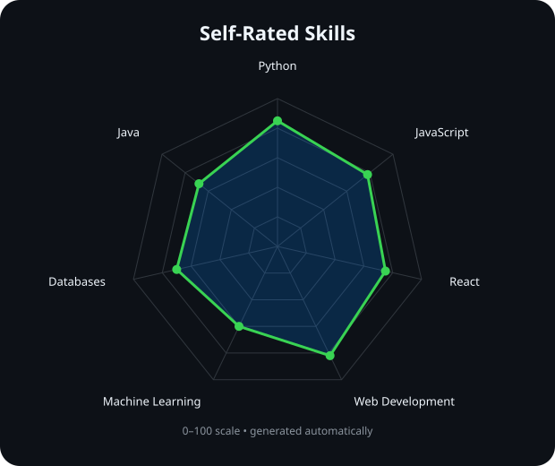
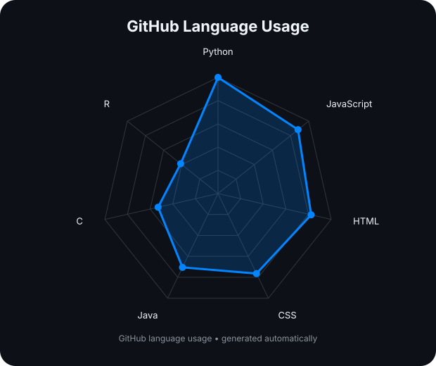
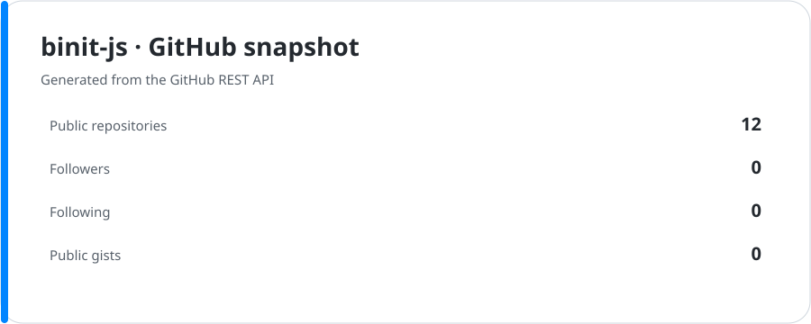
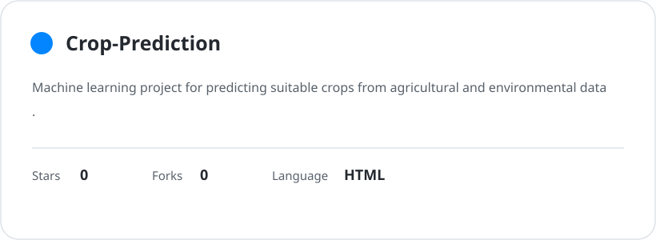
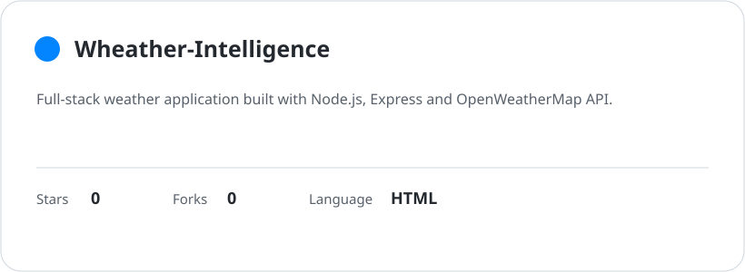
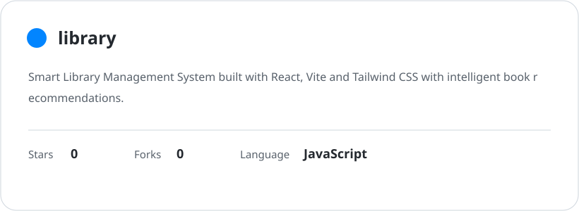
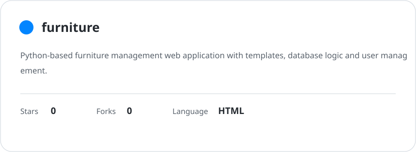

<div align="center">


<br/>
<a href="https://github.com/binit-js"></a>
<a href="https://linkedin.com/in/binit-kumar-nayak"></a>
<a href="https://bsky.app/profile/binit-js"></a>
<a href="mailto:binitkumarnayak1235@gmail.com"></a>
</div>

---

## `~/ about-me`

Hi, I'm **Binit Kumar Nayak**, a developer interested in building useful web applications and exploring Machine Learning.

- 🔭 Building web development projects, from prototypes to full-stack applications
- 🌱 Currently learning Machine Learning
- 💻 Interested in full-stack development, AI and data
- 💬 Ask me about Python, Java, HTML or JavaScript
- ⚡ I enjoy turning ideas into working software

---

## `~/ tech-stack`

### Languages
<p>


</p>

### Web Development
<p>


</p>

### Data & Machine Learning
<p>


</p>

### Databases
<p>


</p>

### Tools & Deployment
<p>


</p>

---

## `~/ skill-radar`
<table><tr>
<td width="50%" align="center"><b>Self-rated skills</b><br/>
<picture><source media="(prefers-color-scheme: dark)" srcset="assets/radar-dark.svg"><source media="(prefers-color-scheme: light)" srcset="assets/radar-light.svg"></picture>
</td>
<td width="50%" align="center"><b>GitHub language usage</b><br/>
<picture><source media="(prefers-color-scheme: dark)" srcset="assets/radar-langs-dark.svg"><source media="(prefers-color-scheme: light)" srcset="assets/radar-langs-light.svg"></picture>
</td>
</tr></table>

---

## `~/ github-activity`
<picture><source media="(prefers-color-scheme: dark)" srcset="assets/metrics.svg"><source media="(prefers-color-scheme: light)" srcset="assets/metrics-light.svg"></picture>

---

## `~/ contribution-snake`
<picture><source media="(prefers-color-scheme: dark)" srcset="https://raw.githubusercontent.com/binit-js/binit-js/output/snake-dark.svg"><source media="(prefers-color-scheme: light)" srcset="https://raw.githubusercontent.com/binit-js/binit-js/output/snake.svg"></picture>

---

## `~/ github-stats`
<picture><source media="(prefers-color-scheme: dark)" srcset="assets/stats-dark.svg"><source media="(prefers-color-scheme: light)" srcset="assets/stats-light.svg"></picture>

---

## `~/ selected-projects`
<table>
<tr>
<td width="50%"><a href="https://github.com/binit-js/PROJECT_ONE"><picture><source media="(prefers-color-scheme: dark)" srcset="assets/card-project-1-dark.svg"><source media="(prefers-color-scheme: light)" srcset="assets/card-project-1-light.svg"></picture></a></td>
<td width="50%"><a href="https://github.com/binit-js/PROJECT_TWO"><picture><source media="(prefers-color-scheme: dark)" srcset="assets/card-project-2-dark.svg"><source media="(prefers-color-scheme: light)" srcset="assets/card-project-2-light.svg"></picture></a></td>
</tr>
<tr>
<td width="50%"><a href="https://github.com/binit-js/PROJECT_THREE"><picture><source media="(prefers-color-scheme: dark)" srcset="assets/card-project-3-dark.svg"><source media="(prefers-color-scheme: light)" srcset="assets/card-project-3-light.svg"></picture></a></td>
<td width="50%"><a href="https://github.com/binit-js/PROJECT_FOUR"><picture><source media="(prefers-color-scheme: dark)" srcset="assets/card-project-4-dark.svg"><source media="(prefers-color-scheme: light)" srcset="assets/card-project-4-light.svg"></picture></a></td>
</tr>
</table>

> Replace the four `PROJECT_*` entries in `assets/projects.json` and this README with your real repositories.

---

## `~/ currently-exploring`
```text
Web Development
Machine Learning
AI & Data
Full-Stack Applications
```

---

## `~/ connect`
<p align="center">
<a href="https://github.com/binit-js"></a>
<a href="https://linkedin.com/in/binit-kumar-nayak"></a>
<a href="https://bsky.app/profile/binit-js"></a>
<a href="mailto:binitkumarnayak1235@gmail.com"></a>
</p>
<p align="center"></p>
<p align="center"><sub>Built with curiosity, code, and a lot of debugging.</sub></p>

